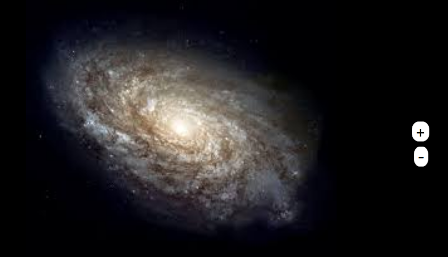
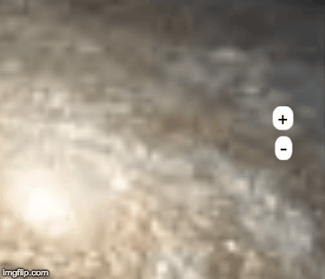
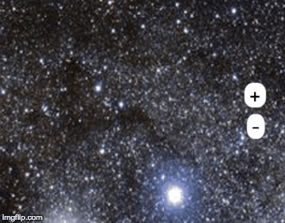
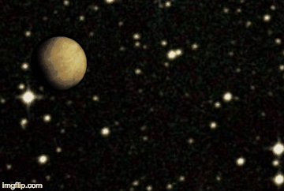
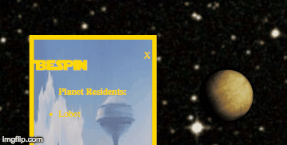
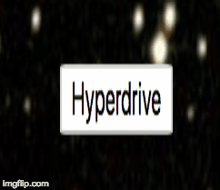

# A Galaxy Far-Far Away
information about who lives on which planet within the star wars universe

## Project Summery

The idea was to have a fully functional starwars universe.

* You could zoom in to reveal planets
* planets give you information about the planet and its inhabitants
* You could warp to other sections in the Galaxy
* the galaxy will have hidden games and activities

## About the Project

## The HTML

The main html components consist of:
* 2 zoom control buttons

```HTML
<!--=== Zoom Button ======-->
<button id='zoom-out'> - </button>
<button id='zoom-in'> + </button>
```

+ a modal

```HTML
<!--========= Modal =======-->
<div class="text"></div>
```

* a button to make new planets

```html
<button id="new-planets">Hyperdrive</button>
```

* planet *divs* inside a container

```HTML
<div class="space">
<!--========= planets ==========-->
<div class="planet alderaan" id='0'></div>
<div class="planet yavin-4" id='1' ></div>
<div class="planet hoth" id='2' ></div>
<div class="planet dagobah" id='3' ></div>
<div class="planet bespin" id='4' ></div>
<div class="planet endor" id='5' ></div>
<div class="planet naboo" id='6' ></div>
<div class="planet coruscant" id='7' ></div>
<div class="planet kanino" id='8' ></div>
<div class="planet geonosis" id='9' ></div>

</div>
```

## How the app works

On load you will see a galaxy with 2 buttons on the right

The plus button will zoom the image in, the minus will zoom the *img* back out



Zooming in and out will change the screen



If you zoom in enough you can start to see planets



Clicking on one of these plantes will reveal a list of the planets inhabitants.



Clicking on one of the inhabitants will provide with some more information about the subject



If you want to see new planets you can click the **hyperdrive** button


